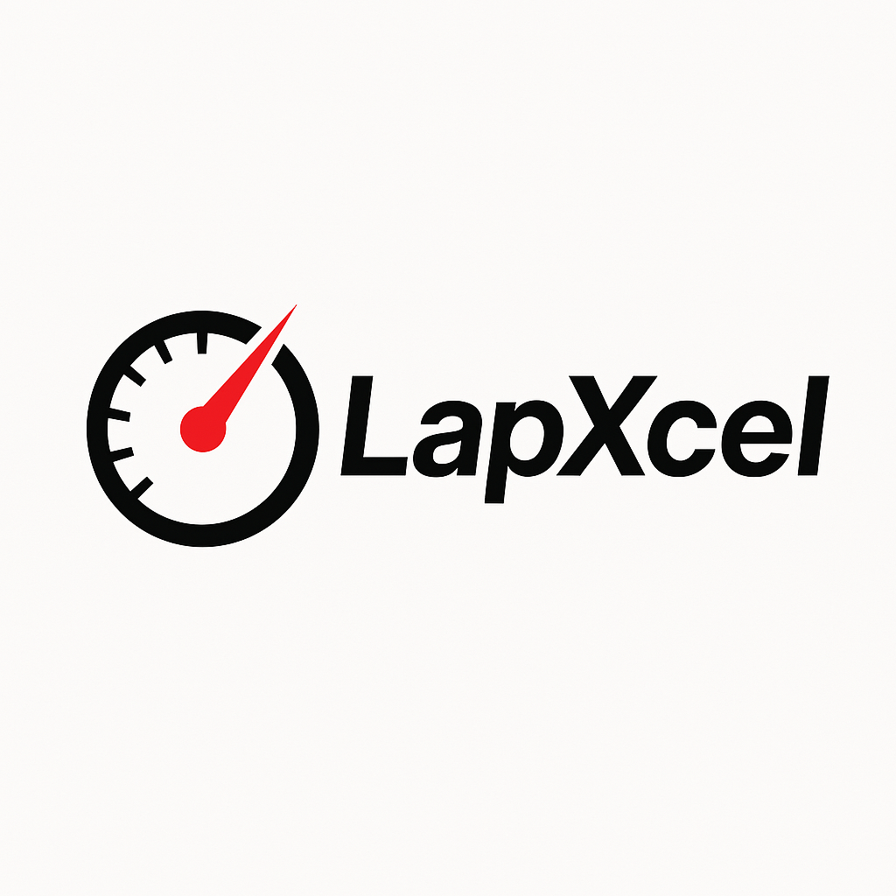

# LapXcel: Sim Racing Telemetry Optimizer

## About
This project aims to develop a software solution to optimize sim racing by analyzing race telemetry data. By ingesting data such as speed, acceleration, braking, and steering inputs, the software will identify patterns to aid racers in getting the theoretical best lap time on any given track. The system will continuously learn from telemetry inputs across various tracks and conditions, allowing sim racers to refine their performance and understand the fastest possible lap dynamics. This tool is intended for professional e-sports teams and individual enthusiasts.

## Benefits and Outcomes
- Improve sim racers lap times
- Analyze telemetry data

## Team
| Name   | Student Number   |
|------------|------------|
| [Colby Todd](https://www.linkedin.com/in/colbytodd/) | 300241178|
| [Engy Elsayed](https://www.linkedin.com/in/engy-els) | 300228400|
| [Sarah Siage](https://www.linkedin.com/in/sarah-siage-167144224)| 300228396|
| [Samuel Braun](https://www.linkedin.com/in/samuel-braun-5a1435221/)| 300238833|

## Stakeholders
Alfred Genadri

## License
This project is licensed under the MIT License.
